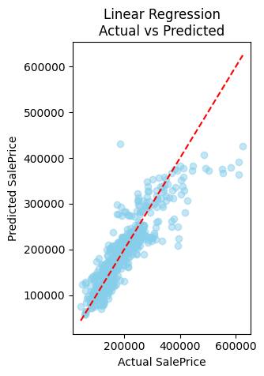
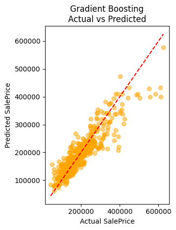

# Heart Disease Prediction using Logistic Regression

This project predicts whether a person is at **risk of heart disease** using the UCI Heart Disease dataset. A **Logistic Regression** model is trained on patient health data, and its performance is evaluated using **accuracy**, **ROC AUC**, and **confusion matrix**. Feature importance is analyzed to understand medical predictors that influence the outcome.

---

##  Objective

- Predict the presence of heart disease (binary classification).
- Analyze and prepare the UCI Heart Disease dataset.
- Train a **Logistic Regression** classifier.
- Evaluate using:
  - Accuracy
  - Confusion Matrix
  - ROC Curve (AUC)
- Identify key health factors influencing predictions.

---

##  Dataset

**UCI Heart Disease Dataset**  
📥 Available on [Kaggle](https://www.kaggle.com/datasets/ronitf/heart-disease-uci)

### Key Features:
- `age`
- `sex`
- `cp` (chest pain type)
- `thalach` (maximum heart rate)
- `exang` (exercise-induced angina)
- `oldpeak`, `slope`, `ca`, `thal`, etc.
- `target` (0 = no disease, 1 = disease)

---

##  Tools & Libraries Used

- `pandas`, `numpy` – data manipulation
- `seaborn`, `matplotlib` – visualizations
- `sklearn` – machine learning modeling & evaluation

---

## Steps Followed

###  Data Cleaning
- Checked for null/missing values
- Ensured proper data types
- No major missing values found

###  EDA (Exploratory Data Analysis)
- Correlation heatmaps
- Distribution plots
- Class imbalance analysis

###  Model Training
- Model: `LogisticRegression()`
- Data split: 80% training, 20% testing
- Performance evaluated on test data

---

##  Results

###  Accuracy Score:
**`0.873`** (87.3%)

###  Confusion Matrix:

- True Positives: 23  
- True Negatives: 21  
- False Positives: 9  
- False Negatives: 7

---

###  ROC Curve:
- **AUC Score: 0.841**

---

###  Feature Importance (Logistic Regression Coefficients)

- Top contributing features:
  - `cp` (chest pain type)
  - `thal`
  - `trestbps`
  - `oldpeak`
  - `sex`
- Least influential:
  - `thalach`, `age`

---

## Results are 

